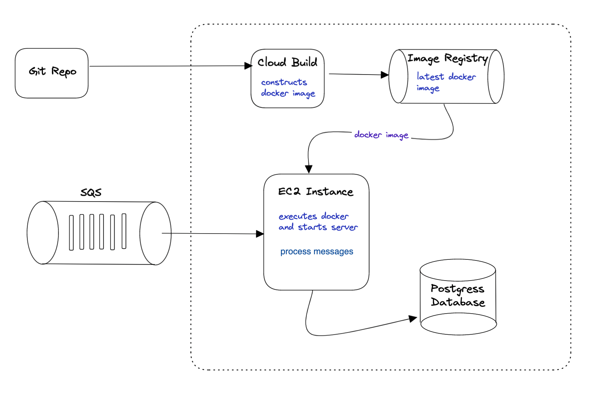

1. How would you deploy this application in production?
- I would set up the following architecture for the app to run in production.

2. What other components would you want to add to make this production ready?
- I would add a server to the existing system for the app to be ready to run in the production. Further I would configure google cloud build, google cloud image registry and set up an EC2 instance to run the server. 

3. How can this application scale with a growing data set.
- We can configure docker to start EC2 instance to handle growing data set

4. How can PII be recovered later on?
- A dataset with restricted access can be created to store the actual PII values and their corresponding masked values in a database for easier retrieval.