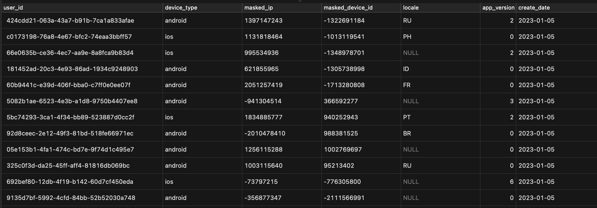

## Decisions made while developing the solution

1. How will you read messages from the queue?
- To read messages from an Amazon Simple Queue Service (SQS) queue, I will use the receive_messages function of the `boto3` library's SQS client. Upon a successful call, the response will contain a Messages field with a list of messages. The messages can be accessed by using the response['Messages'][0] expression

2. What type of data structures should be used?
- To store the received messages I have used hashmap and to store the transformed messages I have made use of list data structure

3. How will you mask the PII data so that duplicate values can be identified?
- I have used the MurmurHash function from the murmurhash library to mask personal identifiable information (PII). This non-cryptographic hash function takes an input value and produces a fixed-size output value (a hash) based on that input. The output value is usually much smaller than the input value and is designed to be unique for a given input, making it effective for identifying duplicate values

4. What will be your strategy for connecting and writing to Postgres?
- To connect and write to a PostgreSQL database I have followed following steps
    1. Installed a PostgreSQL driver psycopg2.
    2. Imported the necessary modules from the psycopg2 library.
    3. Established a connection to the database by creating a new connection object and passing it the connection parameters as arguments. The connection parameters includes the hostname, port, database name, user name, and password for the database.
    4. After connecting to the database, I created a cursor object using the connection's cursor() method. 
    5. Through a cursor object we can execute SQL INSERT statement to insert data into the database and used the cursor.execute() method to execute the SQL statement.
    6. Called the connection's commit() method to save the changes to the database and closed the cursor and connection objects using the cursor.close() and conn.close() methods, respectively.

5. Where and how will your application run?
- Currently, the application is running locally. However, we can use an Amazon Elastic Compute Cloud (EC2) instance to run the application in production 

Here is the screenshot the entries in the database 

 
